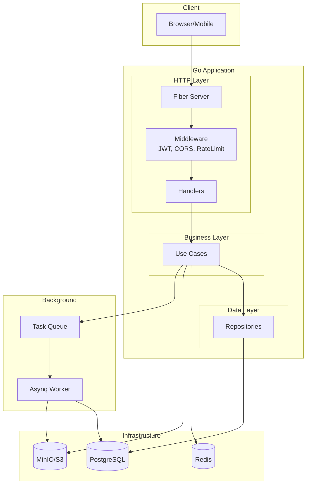

# Go Clean Architecture Boilerplate

Production-ready REST API boilerplate with Clean Architecture, JWT authentication, media uploads, and background workers.

[](https://go.dev/)
[](LICENSE)
[](https://gofiber.io/)
[](https://gorm.io/)
[](https://swagger.io/)

## Features

| Feature | Description |
|---------|-------------|
| **Authentication** | JWT access/refresh tokens, email verification, password reset, roles & permissions |
| **Media Management** | S3/Local storage, polymorphic attachments, image processing, presigned URLs |
| **Articles** | Full CRUD with draft/publish workflow, cover images, SEO slugs |
| **User Profiles** | Avatar uploads, extended user data |
| **Translation** | Google Translate API integration with history |
| **Background Jobs** | Asynq workers for emails, image processing |
| **Code Generation** | Scaffold entities, DTOs, repos, usecases, handlers from migrations |

## Quick Start

```bash
# 1. Clone and setup environment
git clone <repository-url>
cd go-boilerplate
cp .env.example .env

# 2. Start infrastructure (PostgreSQL, Redis, MinIO)
make docker-services

# 3. Run the application
make run

# 4. Open Swagger documentation
# http://localhost:8080/swagger
```

**Verify installation:**
```bash
curl http://localhost:8080/healthz
# {"status":"ok"}
```

## Architecture

### System Overview



### Clean Architecture Layers

```
┌─────────────────────────────────────────────────────────────┐
│                       HTTP Request                          │
└─────────────────────────┬───────────────────────────────────┘
                          ▼
┌─────────────────────────────────────────────────────────────┐
│  HANDLERS (internal/handlers/http/)                         │
│  • Parse request & validate input                           │
│  • Call usecase methods                                     │
│  • Return JSON responses                                    │
│  • Swagger annotations                                      │
└─────────────────────────┬───────────────────────────────────┘
                          ▼
┌─────────────────────────────────────────────────────────────┐
│  USE CASES (internal/usecase/)                              │
│  • Business logic & rules                                   │
│  • Orchestrate repositories                                 │
│  • Return domain errors                                     │
└─────────────────────────┬───────────────────────────────────┘
                          ▼
┌─────────────────────────────────────────────────────────────┐
│  REPOSITORIES (internal/repo/)                              │
│  • persistent/ - Database operations (GORM)                 │
│  • storage/ - File storage (S3, Local)                      │
│  • webapi/ - External APIs (Email, Translation)             │
└─────────────────────────┬───────────────────────────────────┘
                          ▼
┌─────────────────────────────────────────────────────────────┐
│  ENTITIES (internal/entity/)                                │
│  • GORM domain models                                       │
│  • Database schema representation                           │
└─────────────────────────────────────────────────────────────┘
```

### Request Flow Example

```
POST /v1/auth/login
        │
        ▼
┌───────────────┐     ┌──────────────┐     ┌─────────────┐
│ auth/login.go │ ──▶ │ auth/Login() │ ──▶ │ UserRepo    │
│   (handler)   │     │  (usecase)   │     │ GetByEmail()│
└───────────────┘     └──────────────┘     └─────────────┘
        │                    │                    │
        │                    ▼                    ▼
        │             ┌──────────────┐     ┌───────────┐
        │             │ JWT Service  │     │ PostgreSQL│
        │             │ GenerateToken│     └───────────┘
        │             └──────────────┘
        ▼
   JSON Response
   {access_token, refresh_token, user}
```

## Project Structure

```
├── cmd/
│   ├── app/                    # HTTP server entrypoint
│   └── worker/                 # Background worker entrypoint
├── config/                     # Configuration (Viper)
├── internal/
│   ├── app/                    # DI container & bootstrap
│   ├── dto/                    # Request/Response DTOs
│   │   ├── auth/
│   │   ├── media/
│   │   ├── article/
│   │   └── profile/
│   ├── entity/                 # GORM domain models
│   ├── handlers/http/          # Fiber HTTP handlers
│   │   ├── middleware/
│   │   └── v1/
│   │       ├── auth/
│   │       ├── media/
│   │       ├── article/
│   │       └── profile/
│   ├── repo/                   # Repository implementations
│   │   ├── persistent/         # PostgreSQL repos
│   │   ├── storage/            # S3/Local file storage
│   │   └── webapi/             # External APIs
│   ├── usecase/                # Business logic
│   │   ├── auth/
│   │   ├── media/
│   │   ├── article/
│   │   └── profile/
│   └── worker/                 # Asynq task handlers
├── pkg/                        # Reusable packages (20+)
├── migrations/                 # SQL migration files
├── docs/                       # Swagger documentation
└── deployment/docker/          # Docker configuration
```

### SOLID File Organization

Each usecase method gets its own file with a corresponding test file:

```
internal/usecase/auth/              internal/handlers/http/v1/auth/
├── auth.go         (struct+New)    ├── handler.go      (struct+routes)
├── errors.go       (domain errors) ├── login.go        (POST /login)
├── login.go        (Login method)  ├── register.go     (POST /register)
├── login_test.go                   ├── logout.go       (POST /logout)
├── register.go     (Register)      ├── refresh.go      (POST /refresh)
├── register_test.go                ├── me.go           (GET /me)
├── logout.go       (Logout)        ├── handler_test.go
├── refresh.go      (Refresh)       └── mocks_test.go
└── mocks_test.go
```

## Configuration

### Environment Variables

| Variable | Description | Default |
|----------|-------------|---------|
| **Application** |
| `APP_NAME` | Application name | `go-boilerplate` |
| `APP_ENV` | Environment (development/production) | `development` |
| **HTTP Server** |
| `HTTP_PORT` | Server port | `8080` |
| `HTTP_READ_TIMEOUT` | Read timeout | `5s` |
| `HTTP_WRITE_TIMEOUT` | Write timeout | `5s` |
| **Database** |
| `POSTGRES_HOST` | PostgreSQL host | `localhost` |
| `POSTGRES_PORT` | PostgreSQL port | `5432` |
| `POSTGRES_USER` | Database user | `user` |
| `POSTGRES_PASSWORD` | Database password | - |
| `POSTGRES_DB` | Database name | `db` |
| **Redis** |
| `REDIS_HOST` | Redis host | `localhost` |
| `REDIS_PORT` | Redis port | `6379` |
| **JWT** |
| `JWT_SECRET_KEY` | JWT signing key (required in production) | - |
| `JWT_ACCESS_EXPIRY` | Access token expiry | `15m` |
| `JWT_REFRESH_EXPIRY` | Refresh token expiry | `7d` |
| **Storage** |
| `STORAGE_DRIVER` | Storage driver (local/s3) | `local` |
| `S3_ENDPOINT` | S3/MinIO endpoint | - |
| `S3_ACCESS_KEY` | S3 access key | - |
| `S3_SECRET_KEY` | S3 secret key | - |
| `S3_BUCKET` | S3 bucket name | - |
| **Email** |
| `EMAIL_PROVIDER` | Email provider (resend/noop) | `noop` |
| `EMAIL_API_KEY` | Email API key | - |
| `EMAIL_FROM` | From email address | - |

See `.env.example` for the complete list.

### Production Checklist

- [ ] Set `APP_ENV=production`
- [ ] Set a secure `JWT_SECRET_KEY` (min 32 characters)
- [ ] Configure proper CORS origins (`CORS_ALLOW_ORIGINS`)
- [ ] Set up S3 storage (`STORAGE_DRIVER=s3`)
- [ ] Configure email provider (`EMAIL_PROVIDER=resend`)
- [ ] Disable Swagger (`SWAGGER_ENABLED=false`)
- [ ] Set proper rate limits

## API Endpoints

### Authentication

| Method | Endpoint | Auth | Description |
|--------|----------|------|-------------|
| POST | `/v1/auth/register` | No | Register new user |
| POST | `/v1/auth/login` | No | Login, get JWT tokens |
| POST | `/v1/auth/logout` | Yes | Logout, invalidate refresh token |
| POST | `/v1/auth/refresh` | No | Refresh access token |
| GET | `/v1/auth/me` | Yes | Get current user |
| POST | `/v1/auth/verify-email` | No | Verify email with token |
| POST | `/v1/auth/resend-verification` | No | Resend verification email |
| POST | `/v1/auth/forgot-password` | No | Request password reset |
| POST | `/v1/auth/reset-password` | No | Reset password with token |

### Media

| Method | Endpoint | Auth | Description |
|--------|----------|------|-------------|
| POST | `/v1/media/upload` | Yes | Upload file |
| GET | `/v1/media/presigned-url` | Yes | Get presigned upload URL |
| GET | `/v1/media/:id` | Yes | Get media by ID |
| GET | `/v1/media/:id/url` | Yes | Get media URL |
| DELETE | `/v1/media/:id` | Yes | Delete media |
| GET | `/v1/media/attachable/:type/:id` | Yes | Get media by attachable |

### Articles

| Method | Endpoint | Auth | Description |
|--------|----------|------|-------------|
| POST | `/v1/articles` | Yes | Create article |
| GET | `/v1/articles` | No | List articles (paginated) |
| GET | `/v1/articles/:id` | No | Get article by ID |
| PUT | `/v1/articles/:id` | Yes | Update article |
| DELETE | `/v1/articles/:id` | Yes | Delete article |

### Profile

| Method | Endpoint | Auth | Description |
|--------|----------|------|-------------|
| GET | `/v1/profile` | Yes | Get current user profile |
| PUT | `/v1/profile` | Yes | Update profile |

### Translation

| Method | Endpoint | Auth | Description |
|--------|----------|------|-------------|
| POST | `/v1/translate` | No | Translate text |
| GET | `/v1/translate/history` | No | Get translation history |

### Health & Monitoring

| Method | Endpoint | Description |
|--------|----------|-------------|
| GET | `/healthz` | Liveness probe |
| GET | `/readyz` | Readiness probe (checks DB/Redis) |
| GET | `/swagger/*` | Swagger UI (when enabled) |
| GET | `/metrics` | Prometheus metrics (when enabled) |

## Package Reference

Reusable packages in `pkg/`:

| Package | Purpose | Example |
|---------|---------|---------|
| `apperror` | Standardized error codes | `apperror.ErrNotFound.WithMessage("User not found")` |
| `response` | HTTP response helpers | `response.OK(c, data)` |
| `pagination` | Query pagination | `params.Apply(db, []string{"created_at"})` |
| `tx` | Transaction management | `txHelper.RunInTx(ctx, func(txCtx) error {...})` |
| `cache` | Caching abstraction | `cache.Remember(ctx, key, ttl, &dest, fn)` |
| `jwt` | JWT token service | `jwtSvc.GenerateAccessToken(userID, email, role, perms)` |
| `hasher` | Password hashing (bcrypt) | `hasher.Hash(password)` / `hasher.Check(password, hash)` |
| `logger` | Structured logging (Zap) | `l.Info("message %s", arg)` |
| `resilience` | Circuit breaker | `cb.Execute(func() (any, error) {...})` |
| `asynctx` | Async job context | `asynctx.NewJobContext(5 * time.Minute)` |
| `audit` | Audit logging | `logger.LogCreate(ctx, "user", id, &userID, values)` |
| `asynq` | Task queue client/server | `client.EnqueueTask(task)` |
| `postgres` | Database connection | `postgres.New(dsn, opts...)` |
| `redis` | Redis client | `redis.New(cfg)` |
| `httpserver` | HTTP server lifecycle | `server.Start()` / `server.Shutdown()` |
| `json` | Fast JSON (goccy) | `json.Marshal(v)` / `json.Unmarshal(data, v)` |
| `codegen` | Code scaffolding | `make gen-full MIGRATION=000010` |

## Patterns & Conventions

### Error Handling

```go
// Repository layer - return sentinel errors
if errors.Is(err, gorm.ErrRecordNotFound) {
    return nil, repo.ErrNotFound
}

// UseCase layer - return domain errors
if errors.Is(err, repo.ErrNotFound) {
    return nil, ErrInvalidCredentials  // Don't expose "user not found"
}

// Handler layer - map to HTTP responses
if errors.Is(err, auth.ErrInvalidCredentials) {
    return response.Unauthorized(c, "Invalid email or password")
}
```

### Validation

```go
// DTO with validation tags
type RegisterRequest struct {
    Email    string `json:"email" validate:"required,email"`
    Password string `json:"password" validate:"required,min=8"`
    Name     string `json:"name" validate:"required,min=2,max=100"`
}

// Handler validates input
if err := h.validator.Struct(req); err != nil {
    return response.ValidationError(c, parseValidationErrors(err))
}
```

### Transactions

```go
err := txHelper.RunInTx(ctx, func(txCtx context.Context) error {
    // All operations use txCtx - automatic rollback on error
    if err := userRepo.Create(txCtx, user); err != nil {
        return err
    }
    if err := profileRepo.Create(txCtx, profile); err != nil {
        return err  // Rolls back user creation too
    }
    return nil  // Commits transaction
})
```

### Response Format

```json
// Success
{
  "success": true,
  "data": { "id": 1, "email": "user@example.com" },
  "request_id": "abc-123"
}

// Error (simple)
{
  "success": false,
  "error": {
    "code": "NOT_FOUND",
    "message": "Article not found"
  },
  "request_id": "abc-123"
}

// Error (validation with multiple field errors)
{
  "success": false,
  "error": {
    "code": "VALIDATION_ERROR",
    "message": "Validation failed",
    "details": {
      "email": "must be a valid email",
      "password": "must be at least 8 characters",
      "name": "is required"
    }
  },
  "request_id": "abc-123"
}

// Paginated List
{
  "success": true,
  "data": [{ "id": 1 }, { "id": 2 }],
  "meta": {
    "page": 1,
    "limit": 20,
    "total": 100,
    "total_pages": 5
  }
}
```

## Adding New Features

### Step-by-Step Guide

**Example: Adding a "Comments" feature**

**1. Create migration:**
```bash
make migrate-create name=create_comments
```

Edit `migrations/000012_create_comments.up.sql`:
```sql
CREATE TABLE comments (
    id BIGSERIAL PRIMARY KEY,
    article_id BIGINT NOT NULL REFERENCES articles(id) ON DELETE CASCADE,
    user_id BIGINT NOT NULL REFERENCES users(id) ON DELETE CASCADE,
    content TEXT NOT NULL,
    created_at TIMESTAMPTZ DEFAULT NOW(),
    updated_at TIMESTAMPTZ DEFAULT NOW()
);
```

**2. Generate scaffolding:**
```bash
make gen-full MIGRATION=000012
```

This generates:
- `internal/entity/comment.go`
- `internal/dto/comment/request.go` & `response.go`
- `internal/repo/persistent/comment.go`
- `internal/usecase/comment/` (with SOLID file structure)
- `internal/handlers/http/v1/comment/`

**3. Wire up dependencies** in `internal/app/app.go`:
```go
// In repositories struct
comments repo.CommentRepo

// In initRepositories()
comments: persistent.NewCommentRepo(db),

// In usecases struct
comments usecase.Comment

// In initUseCases()
comments: comment.New(repos.comments, l),
```

**4. Register routes** in `internal/handlers/http/router.go`:
```go
commentHandler := comment.New(uc.comments, jwtService, l)
commentHandler.RegisterRoutes(apiV1)
```

**5. Run quality checks:**
```bash
make check-all
```

## Background Workers

### Running the Worker

```bash
# Development
make run-worker

# With Docker (full stack)
make docker-dev
```

### Available Tasks

| Task Type | Handler | Description |
|-----------|---------|-------------|
| `email:notification` | `email.go` | Send transactional emails |
| `image:processing` | `image_processing.go` | Generate thumbnails, resize |

### Creating Custom Tasks

1. Define task type in `internal/worker/tasks/types.go`
2. Create handler in `internal/worker/tasks/`
3. Register in `internal/worker/worker.go`

```go
// 1. Define task type
const TypeMyTask = "my:task"

// 2. Create handler
func HandleMyTask(ctx context.Context, t *asynq.Task) error {
    var payload MyTaskPayload
    if err := json.Unmarshal(t.Payload(), &payload); err != nil {
        return err
    }
    // Process task...
    return nil
}

// 3. Register handler
mux.HandleFunc(tasks.TypeMyTask, tasks.HandleMyTask)
```

## Testing

### Running Tests

```bash
# Unit tests with coverage
make test

# Integration tests (requires Docker)
make test-integration

# Generate HTML coverage report
make coverage
```

### Test Organization

- Each usecase method has its own test file: `login_test.go`
- Mocks are generated with `go generate ./...`
- Handler tests use Fiber's `app.Test()` method

```bash
# Regenerate mocks after interface changes
make generate
```

## Deployment

### Docker Commands

```bash
# Start infrastructure only (for local dev with Air)
make docker-services

# Start full stack (DB + Redis + App + Worker)
make docker-dev

# Rebuild and start
make docker-dev-build

# View logs
make docker-logs

# Stop all containers
make docker-stop
```

### Production Deployment

```bash
# Build production binary
make build

# Run migrations on production
export PROD_DATABASE_URL='postgres://...'
make migrate-prod
```

## Makefile Commands

### Development

| Command | Description |
|---------|-------------|
| `make dev` | Run with Air hot reload |
| `make run` | Run application |
| `make build` | Build binary |
| `make run-worker` | Run background worker |

### Code Quality

| Command | Description |
|---------|-------------|
| `make fmt` | Format code |
| `make lint` | Run linter |
| `make vuln` | Check vulnerabilities |
| `make test` | Run tests |
| `make check-all` | Run all checks |

### Database

| Command | Description |
|---------|-------------|
| `make migrate-up` | Apply migrations |
| `make migrate-down` | Rollback 1 migration |
| `make migrate-create name=X` | Create new migration |
| `make migrate-status` | Show current version |

### Code Generation

| Command | Description |
|---------|-------------|
| `make generate` | Regenerate mocks |
| `make gen MIGRATION=X` | Generate entity, dto, repo |
| `make gen-full MIGRATION=X` | Generate all layers |
| `make swag` | Regenerate Swagger docs |

### Docker

| Command | Description |
|---------|-------------|
| `make docker-services` | Start DB, Redis, MinIO |
| `make docker-dev` | Start full stack |
| `make docker-stop` | Stop all containers |
| `make docker-logs` | View container logs |

## Contributing

See [CONTRIBUTING.md](.github/CONTRIBUTING.md) for guidelines.

## License

MIT License - see [LICENSE](LICENSE) for details.
