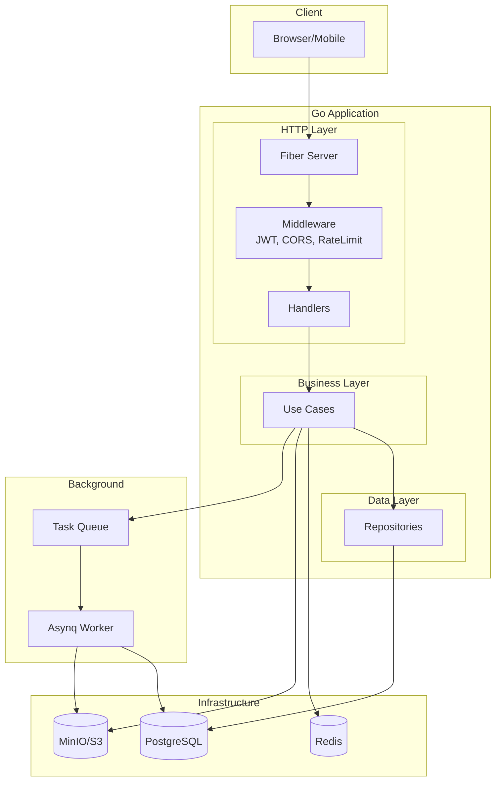

# Go Clean Architecture Boilerplate

Production-ready REST API boilerplate with Clean Architecture, JWT authentication, media uploads, and background workers.

[](https://go.dev/)
[](LICENSE)
[](https://gofiber.io/)
[](https://gorm.io/)
[](https://swagger.io/)

## Features

- **Authentication** — JWT access/refresh tokens, email verification, password reset, roles & permissions
- **Media Management** — S3/Local storage, polymorphic attachments, image processing, presigned URLs
- **Articles** — Full CRUD with draft/publish workflow, cover images, SEO slugs
- **Translation** — Google Translate API integration with history
- **Background Jobs** — Asynq workers for emails, image processing
- **Code Generation** — Scaffold all layers from a single migration file

## Quick Start

```bash
# Clone and configure
git clone <repository-url>
cd go-boilerplate
cp .env.example .env

# Start infrastructure
make docker-services

# Run the application
make run
```

Verify it's running:

```bash
curl http://localhost:8080/healthz    # Liveness probe
curl http://localhost:8080/readyz     # Readiness probe (checks DB/Redis)
```

## API Documentation

Once the app is running, Swagger UI is available at:

```
http://localhost:8080/swagger/
```

All endpoints, request/response schemas, and authentication requirements are documented there.

## Architecture



### Layer Flow

```
Handler → UseCase → Repository → Entity/External API
```

- **Handlers** — Parse requests, validate input, return JSON responses
- **Use Cases** — Business logic, orchestrate repositories, return domain errors
- **Repositories** — Data access (PostgreSQL, S3, external APIs)
- **Entities** — GORM domain models

## Project Structure

```
├── cmd/
│   ├── app/                    # HTTP server entrypoint
│   └── worker/                 # Background worker entrypoint
├── config/                     # Configuration (Viper)
├── internal/
│   ├── app/                    # DI container & bootstrap
│   ├── dto/                    # Request/Response DTOs
│   ├── entity/                 # GORM domain models
│   ├── handlers/http/          # Fiber HTTP handlers
│   │   ├── middleware/
│   │   └── v1/
│   ├── repo/                   # Repository implementations
│   │   ├── persistent/         # PostgreSQL repos
│   │   ├── storage/            # S3/Local file storage
│   │   └── webapi/             # External APIs
│   ├── usecase/                # Business logic
│   └── worker/                 # Asynq task handlers
├── pkg/                        # Reusable packages
├── migrations/                 # SQL migration files
├── docs/                       # Swagger documentation
└── deployment/docker/          # Docker configuration
```

Each usecase method gets its own file with a corresponding test file (SOLID principle):

```
internal/usecase/auth/
├── auth.go            # Struct + constructor
├── errors.go          # Domain errors
├── login.go           # Login method
├── login_test.go      # Login tests
├── register.go
├── register_test.go
└── ...
```

## Configuration

Copy `.env.example` and configure the required variables. See [Deployment](docs/deployment.md) for the full environment variable reference and production checklist.

## Commands

### Development

| Command | Description |
|---------|-------------|
| `make run` | Run application |
| `make dev` | Run with Air hot reload |
| `make build` | Build binary |
| `make run-worker` | Run background worker |

### Code Quality

| Command | Description |
|---------|-------------|
| `make check-all` | Run all checks (format, lint, vuln, test) |
| `make fmt` | Format code |
| `make lint` | Run linter |
| `make vuln` | Check vulnerabilities |
| `make test` | Run unit tests |

### Database

| Command | Description |
|---------|-------------|
| `make migrate-up` | Apply migrations |
| `make migrate-down` | Rollback 1 migration |
| `make migrate-create name=X` | Create new migration |
| `make migrate-status` | Show current version |

### Code Generation

| Command | Description |
|---------|-------------|
| `make gen-full MIGRATION=X` | Generate all layers from migration |
| `make wire` | Auto-wire DI, routes, and contracts |
| `make generate` | Regenerate mocks |
| `make swag` | Regenerate Swagger docs |

### Docker

| Command | Description |
|---------|-------------|
| `make docker-services` | Start DB, Redis, MinIO |
| `make docker-dev` | Start full stack |
| `make docker-stop` | Stop all containers |
| `make docker-logs` | View container logs |

## Adding a New Feature

```bash
make migrate-create name=create_orders       # 1. Create migration
# Edit the .up.sql and .down.sql files        # 2. Write SQL
make migrate-up                               # 3. Run migration
make gen-full MIGRATION=000012               # 4. Generate all layers
make wire                                     # 5. Auto-wire DI, routes, contracts
make check-all                                # 6. Verify everything
make swag                                     # 7. Regenerate Swagger docs
```

## Testing

```bash
make test                # Unit tests with coverage
make test-integration    # Integration tests (requires Docker)
make coverage            # Generate HTML coverage report
make generate            # Regenerate mocks after interface changes
```

## Further Reading

| Document | Description |
|----------|-------------|
| [Code Patterns](docs/code-patterns.md) | Error handling, validation, transactions, response format, SOLID file organization, reusable packages |
| [Deployment](docs/deployment.md) | Docker setup, production build, environment variables, production checklist |

## License

MIT License — see [LICENSE](LICENSE) for details.
