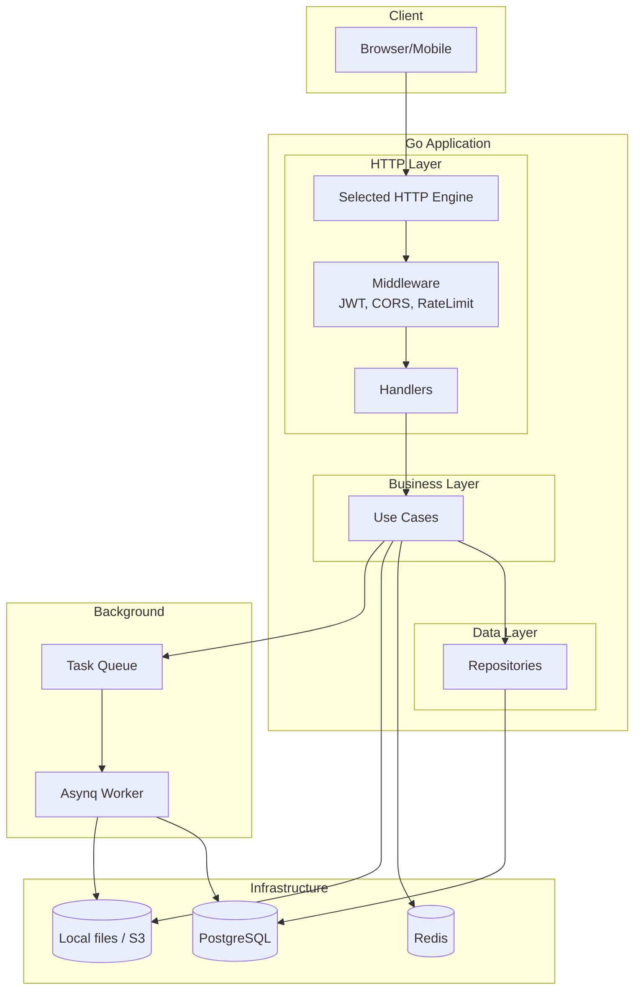

# gobase

Go HTTP template with full application and minimal service profiles. Select Gin, standard `net/http`, or Fiber when creating a project. The default full profile includes Clean Architecture, JWT authentication, media uploads, and background workers.

[](https://go.dev/)
[](LICENSE)
[](docs/http-engines.md)
[](https://gorm.io/)
[](https://swagger.io/)

## Features

The following application features belong to the default `full` profile. The `minimal` profile includes configuration, logging, native HTTP routing, request and response helpers, health probes, and graceful shutdown without required infrastructure.

- **Authentication** — Register, login, JWT access/refresh tokens, logout, and current user endpoints
- **Authorization** — JWT role and permission middleware
- **Media Management** — S3/Local storage, polymorphic attachments, image processing, presigned URLs
- **Articles** — Full CRUD with draft/publish workflow, cover images, SEO slugs
- **Translation** — Google Translate API integration with history
- **Background Jobs** — Asynq workers for emails, image processing
- **Code Generation** — Scaffold all layers from a single migration file
- **HTTP Engine Selection** — Create a project with Gin, standard `net/http`, or Fiber

## Project Status

The HTTP engine refactor and Phase 1 release readiness work are merged into `master` through [PR #46](https://github.com/zoe606/gobase/pull/46). Quality and all three engine jobs passed after the merge. Verification covers project generation, native handlers, CRUD generation, Swagger, HTTP integration, and Docker app and worker execution. See the [release readiness report](docs/release-readiness.md) for the tested revisions and workflow links.

Engine foundation is merged through [PR #53](https://github.com/zoe606/gobase/pull/53), [PR #57](https://github.com/zoe606/gobase/pull/57), and [PR #58](https://github.com/zoe606/gobase/pull/58). Docker images run as UID and GID `65532`. This source adds explicit minimal service generation. The next work validates three standalone applications with different business domains, one per engine, and their HTTP workflows. Each application will have its own repository. Monorepo generation is outside the current plan. Existing template and Docker checks provide foundation evidence; production readiness still requires application and deployment evidence for a defined scenario. See the [roadmap](docs/roadmap.md) for scope and [runtime permissions](docs/deployment.md#runtime-permissions) before using full-profile bind mounts or existing upload volumes.

Email verification and password reset have use cases and token persistence, but their HTTP routes and queued email tasks still need to be connected. These flows and OpenTelemetry metrics export remain deferred application features.

## Create a Project

Install Go 1.27.2 or newer. Select the engine when creating the project:

```bash
git clone https://github.com/zoe606/gobase.git gobase
cd gobase
make init ENGINE=gin MODULE=github.com/your-org/myapp APP_NAME=myapp OUTPUT=../myapp
```

Gin v1.12.0 is the default. Use `ENGINE=stdlib` for `http.ServeMux`, or `ENGINE=fiber` for Fiber v2. Each output contains one engine. See [HTTP Engines](docs/http-engines.md) for the architecture and compatibility rules.

`PROFILE=full` is the default and preserves existing creation commands. To create a service without bundled business features or infrastructure:

```bash
make init PROFILE=minimal ENGINE=stdlib MODULE=github.com/your-org/service APP_NAME=service OUTPUT=../service
cd ../service
make run
```

Both `/healthz` and `/readyz` return `OK`. No database, Redis, storage, email sender, or worker is required. The generated README describes its native handler API and app-only Docker setup. Configuration files are optional. Export environment variables to override defaults. SQL CRUD and persistence wiring commands return a clear error because persistence is omitted. See [minimal services](docs/minimal-services.md) for the file and dependency set.

## Run a Project

These instructions apply to the `full` profile. Minimal services use the commands above and their generated README.

```bash
# Configure the generated project
cd ../myapp
cp .env.example .env
cp config/config.example.yaml config/config.yaml

# Start infrastructure
make docker-services

# Run the application
make run
```

The development app applies database migrations on startup. Start the worker in another terminal with `make run-worker`. The `.env` file supplies Docker Compose variables. Local Go commands read `config/config.yaml` and exported environment variables; update both configurations when changing connection ports.

New projects use local storage. MinIO is optional; see [Deployment](docs/deployment.md) for S3 configuration.

Verify it's running:

```bash
curl http://localhost:8080/healthz    # Liveness probe
curl http://localhost:8080/readyz     # Readiness probe (checks PostgreSQL)
```

## API Documentation

Once the app is running, Swagger UI is available at:

```
http://localhost:8080/swagger/
```

All endpoints, request/response schemas, and authentication requirements are documented there.

`GET /v1/articles` accepts an omitted or empty `status`, or the exact values `draft` and `published`. Other values return HTTP 400 with `VALIDATION_ERROR` and field details. Malformed queries retain `INVALID_QUERY`. Pagination continues to use `page` and `limit` with the existing defaults and normalization.

## Architecture

The diagram below describes the full application. Minimal services keep only configuration, logging, the selected native HTTP engine, HTTP helpers, and process lifecycle. Both profiles use the generic `response.Response[T]` envelope.


```mermaid
flowchart TB
    subgraph Client
        Browser[Browser/Mobile]
    end

    subgraph "Go Application"
        subgraph "HTTP Layer"
            Server[Selected HTTP Engine]
            MW[Middleware<br/>JWT, CORS, RateLimit]
            Handlers[Handlers]
        end

        subgraph "Business Layer"
            UseCases[Use Cases]
        end

        subgraph "Data Layer"
            Repos[Repositories]
        end
    end

    subgraph "Infrastructure"
        PG[(PostgreSQL)]
        Redis[(Redis)]
        Storage[(Local files / S3)]
    end

    subgraph "Background"
        Worker[Asynq Worker]
        Queue[Task Queue]
    end

    Browser --> Server
    Server --> MW --> Handlers
    Handlers --> UseCases
    UseCases --> Repos
    Repos --> PG
    UseCases --> Redis
    UseCases --> Storage
    UseCases --> Queue
    Queue --> Worker
    Worker --> PG
    Worker --> Storage
```

### Layer Flow

```
Handler → UseCase → Repository → Entity/External API
```

- **Handlers** — Parse requests, validate input, return JSON responses
- **Use Cases** — Business logic, orchestrate repositories, return domain errors
- **Repositories** — Data access (PostgreSQL, file storage, external APIs)
- **Entities** — GORM domain models

## Project Structure

The directories below describe the full profile. Generated HTTP handlers use the selected engine. The template checkout runs Fiber; full engine sources are maintained under `pkg/scaffold/templates/{gin,stdlib,fiber}`, minimal sources under `pkg/scaffold/templates/minimal`, and CRUD templates under `pkg/codegen/generator/templates/handler`.

```
├── cmd/
│   ├── app/                    # HTTP server entrypoint
│   └── worker/                 # Background worker entrypoint
├── config/                     # Configuration (Viper)
├── internal/
│   ├── app/                    # DI container & bootstrap
│   ├── dto/                    # Request/Response DTOs
│   ├── entity/                 # GORM domain models
│   ├── handlers/http/          # Native HTTP handlers
│   │   ├── middleware/
│   │   └── v1/
│   ├── repo/                   # Repository implementations
│   │   ├── persistent/         # PostgreSQL repos
│   │   ├── storage/            # S3/Local file storage
│   │   └── webapi/             # External APIs
│   ├── usecase/                # Business logic
│   └── worker/                 # Asynq task handlers
├── pkg/                        # Reusable packages
├── migrations/                 # SQL migration files
├── docs/                       # Swagger and project documentation
└── deployment/docker/          # Docker configuration
```

Each usecase method gets its own file with a corresponding test file (SOLID principle):

```
internal/usecase/auth/
├── auth.go            # Struct + constructor
├── errors.go          # Domain errors
├── login.go           # Login method
├── login_test.go      # Login tests
├── register.go
├── register_test.go
└── ...
```

## Configuration

Copy both example files as shown in [Run a Project](#run-a-project). Docker Compose reads `.env`. Local Go commands read `config/config.yaml` and exported environment variables. See [Deployment](docs/deployment.md) for storage options, environment variables, and production configuration.

## Commands

The tables below describe full-profile commands. Run application commands from the generated project's directory. Project creation, `make test-engines`, and `make test-minimal` run from the template checkout. Minimal services provide their own smaller Makefile.

### Development

| Command | Description |
|---------|-------------|
| `make run` | Run application |
| `make dev` | Run with Air hot reload |
| `make build` | Build binary |
| `make run-worker` | Run background worker |

### Code Quality

| Command | Description |
|---------|-------------|
| `make check-all` | Run all checks (format, lint, vuln, test) |
| `make fmt` | Format code |
| `make lint` | Run linter |
| `make vuln` | Check vulnerabilities |
| `make test` | Run unit tests |
| `make test-engines` | Verify generated Gin, stdlib, and Fiber projects from the template checkout |
| `make test-minimal` | Verify minimal output, HTTP contracts, startup, and shutdown for all three engines without infrastructure |

### Database

| Command | Description |
|---------|-------------|
| `make migrate-up` | Apply migrations |
| `make migrate-down` | Rollback 1 migration |
| `make migrate-create name=X` | Create new migration |
| `make migrate-status` | Show current version |

### Code Generation

| Command | Description |
|---------|-------------|
| `make gen-full MIGRATION=X` | Generate all layers from migration |
| `make wire` | Auto-wire DI, routes, and contracts |
| `make generate` | Regenerate mocks |
| `make swag` | Regenerate Swagger docs |

### Docker

| Command | Description |
|---------|-------------|
| `make docker-services` | Start PostgreSQL and Redis |
| `make docker-services-s3` | Start services with optional MinIO |
| `make docker-dev` | Start full stack |
| `make docker-dev-build` | Rebuild and start full stack |
| `make docker-stop` | Stop all containers |
| `make docker-logs` | View container logs |

The app and worker run as UID and GID `65532`. Follow [runtime permissions](docs/deployment.md#runtime-permissions) for the local configuration bind mount and any existing upload volume before starting the full stack.

## Adding a New Feature

```bash
make migrate-create name=create_orders       # 1. Create migration
# Edit the .up.sql and .down.sql files        # 2. Write SQL
make migrate-up                               # 3. Run migration
make gen-full MIGRATION=000012               # 4. Generate all layers
make wire                                     # 5. Auto-wire DI, routes, contracts
make check-all                                # 6. Verify everything
make swag                                     # 7. Regenerate Swagger docs
```

## Testing

```bash
make test                # Unit tests with coverage
make test-integration    # Integration tests (requires a running app, PostgreSQL, and Redis)
make coverage            # Generate HTML coverage report
make generate            # Regenerate mocks after interface changes
```

## Further Reading

| Document | Description |
|----------|-------------|
| [HTTP Engines](docs/http-engines.md) | Engine selection, independent templates, shared core, and compatibility |
| [Roadmap](docs/roadmap.md) | Engine foundation, standalone application validation, and HTTP workflow plans |
| [Release Readiness](docs/release-readiness.md) | Phase 1 implementation, local runtime results, and passing CI evidence |
| [Code Patterns](docs/code-patterns.md) | Error handling, validation, transactions, response format, SOLID file organization, reusable packages |
| [Deployment](docs/deployment.md) | Docker setup, production build, environment variables, production checklist |

## License

MIT License — see [LICENSE](LICENSE) for details.
