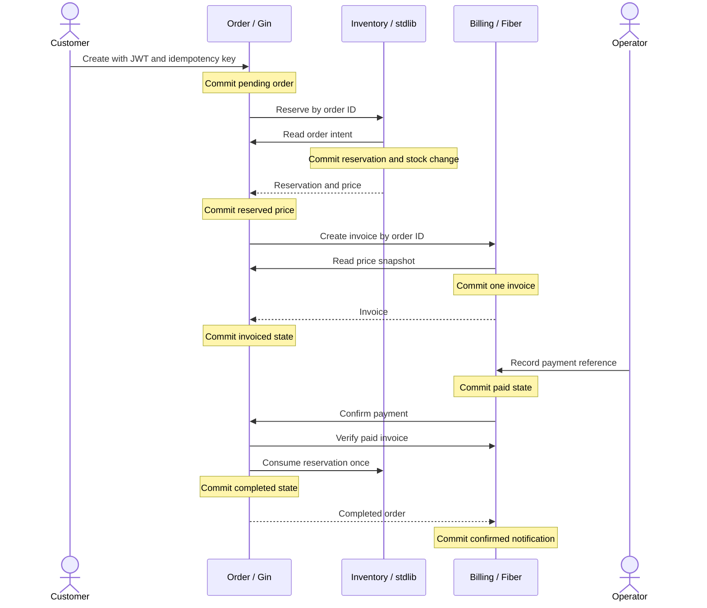

# Commerce Verification

Date: October 9, 2026.

## Scope and Revisions

The initial Commerce workflow is implemented in three independent private repositories. Each owns its module, native HTTP handlers, migrations, data, tests, configuration, Dockerfile, and CI. The common test fixture belongs to Order. There is no shared Go workspace.

| Application | Engine | Repository | Verified application revision | Local selective coverage |
|-------------|--------|------------|-------------------------------|--------------------------|
| Order | Gin | [commerce-order](https://github.com/zoe606/commerce-order) | `45baeae241f37218d2f3f5f758b566fc174de900` | 85.6% |
| Inventory | stdlib | [commerce-inventory](https://github.com/zoe606/commerce-inventory) | `1dd4467f4097216f392cae019e4687b439d12d3a` | 85.2% |
| Billing | Fiber | [commerce-billing](https://github.com/zoe606/commerce-billing) | `2cc3899243ad7a7f2e5fe90ae2eb6a0bd625a9ca` | 87.0% |

The applications were generated from gobase `2177675e4ea4409e56905f4b2f966dd4d3b755e5` and adopted the generator workflow test from `631ff36515fce259c0eda237c7716feb359cc96d`. These production changes merged in [PR #59](https://github.com/zoe606/gobase/pull/59) as `a611e8406f491bb259d8a120b89f86b1f7ebaab5`.

Local application paths are `.worktrees/commerce-order`, `.worktrees/commerce-inventory`, and `.worktrees/commerce-billing`. They are separate Git repositories under an ignored directory. Product implementation files are not part of the gobase repository.

## Implemented Workflow

One order contains one SKU and quantity. Monetary amounts are integer IDR values. Inventory owns the price. Order persists the accepted quantity and price. Billing records an invoice and a trusted operator's payment reference. This operation does not charge a payment provider.



No database transaction remains open during an HTTP call. A failure preserves the last committed state. The same order key resumes a pending or reserved order. A paid invoice with failed confirmation remains identifiable and can be retried. Repeated reservation, payment, consumption, and confirmation preserve their operation identity.

Internal service and operator credentials are distinct. Inventory's Order credential can read snapshots but cannot confirm payments. Customer reads require ownership. Each application documents exact endpoints and environment variables in its own `docs/commerce.md`.

## Local Verification

The environment uses Go 1.27.2 and golangci-lint 2.14.0 on macOS arm64. PostgreSQL 17 uses TLS with three separately owned databases. Redis 7 uses database numbers 0, 1, and 2. Explicit migrations run before production startup. Fixture host ports are 55430 and 56380.

| Check | Result |
|-------|--------|
| Each application's format, lint, reachable vulnerability scan, race tests, and 85% coverage gate | Passed |
| PostgreSQL repositories and native business handlers with COMMERCE_TEST_DSN | Passed |
| Required credentials, peer URL validation, request IDs, redirects, deadlines, and response limits | Passed |
| Initial workflow with independently running native processes | Ten scenarios passed |
| Non-root Docker images with production configuration | Ten scenarios passed on the recorded application revisions |
| Container identity, config, migrations, CA bundle, temporary files, and writable storage | Passed in local Docker run |
| Restart, retained business state, SIGTERM, and clean final shutdown | Passed |

Coverage excludes the original infrastructure exclusions and generated example HTTP handlers whose routes are disabled in each product. Business handlers, use cases, and repositories remain included. Dormant foundation package unit tests still run. The threshold is 85% in each Makefile and CI workflow.

Inventory locks reservation operations using the canonical PostgreSQL UUID value. A regression test holds the order's lock and verifies that an uppercase UUID cannot bypass it or restore stock before the lock is released. The test failed before the correction and passed afterward. Native and Docker workflow checks passed again with the corrected Inventory revision.

The ten workflow scenarios are:

1. Authentication, access rules, and invalid input.
2. Order, reservation, invoice, payment, stable identities, and conflicts.
3. Eight concurrent orders competing for three stock units. Three succeed and five report insufficient stock.
4. Concurrent creates with the same customer and key. One order and reservation remain.
5. Billing outage after reservation. The same key resumes after recovery.
6. Order outage after payment. The paid invoice retains pending confirmation and recovers.
7. Inventory outage after payment. Retried confirmation consumes stock once.
8. Lost reservation response after its transaction commits. Retrying uses the same reservation.
9. A slow downstream response. The two-second client timeout returns a failure within the tested three-second bound.
10. Application restart. Completed order and confirmed invoice remain persisted.

Repeat from Order after cloning all three application repositories:

```bash
INVENTORY_PROJECT=/absolute/path/to/commerce-inventory \
BILLING_PROJECT=/absolute/path/to/commerce-billing \
bash scripts/commerce-e2e.sh
```

Add `COMMERCE_E2E_DOCKER=1` to run the same workflow with product images. The Docker harness uses `host.docker.internal` on macOS with Docker Desktop or OrbStack. Linux portability of this harness is not verified. Containers have one CPU and 512 MiB each. These limits describe the fixture; they are not measured capacity or a production sizing recommendation.

Process logs and temporary Docker environment files are retained under Order's ignored `integration-test/commerce/.runtime/evidence-<uuid>` directory. Runtime environment files have mode 600. Fixture services retain their test data. Application processes and containers stop after verification.

## Remote CI

Each application's CI applies migrations to PostgreSQL 17 and runs the native handler and repository tests. It also checks formatting, lint, all-package builds, race tests, the coverage threshold, and reachable vulnerabilities. CI results for the business revisions recorded above are:

| Application | GitHub CI | Result |
|-------------|-----------|--------|
| Order | [Run 37912166073](https://github.com/zoe606/commerce-order/actions/runs/37912166073) | Passed |
| Inventory | [Run 37947971768](https://github.com/zoe606/commerce-inventory/actions/runs/37947971768) | Passed |
| Billing | [Run 37912450130](https://github.com/zoe606/commerce-billing/actions/runs/37912450130) | Passed |

Cross-repository end-to-end tests are currently local. These separate CI runs do not execute the full three-application workflow.

## Remaining Work

The initial workflow and local production configuration are verified within the limits above. This is not a complete production-readiness claim.

- Select an external deployment environment and verify TLS, credentials, migrations, and runtime behavior there.
- Verify backup and restore into isolated databases. Existing application data must remain intact.
- Agree on workload, resource limits, latency, throughput, and error criteria before measuring performance.
- Define coordinated customer cancellation, reservation release, invoice voiding, and refunds. Inventory release currently requires an operator to stop concurrent retries and reconcile the order and invoice.
- Select and test a payment provider when real charging is required. Operator payment recording is the current substitute.
- Replace inherited example Swagger specifications with the Commerce API before enabling Swagger.
- Verify credential rotation and database certificate identity. The local fixture uses `sslmode=require`, which encrypts transport but does not verify certificate identity.
- Port the Docker end-to-end harness to Linux before using it in a common integration workflow.

Issues [#60](https://github.com/zoe606/gobase/issues/60) and [#56](https://github.com/zoe606/gobase/issues/56) remain open for these verification criteria. [#55](https://github.com/zoe606/gobase/issues/55) is closed as not planned. The [execution plan](plans/commerce-execution.md) and [roadmap](roadmap.md) track the next work.
