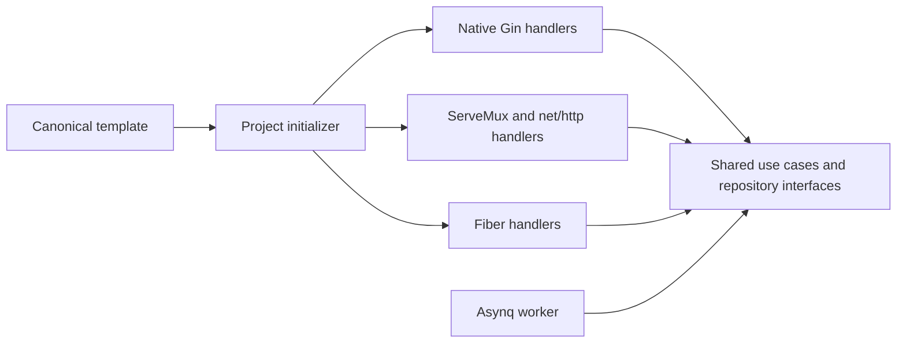

# HTTP Engines

Projects select an HTTP engine and a `full` or `minimal` profile during creation. Both are recorded in `.gobase.json`. The application does not read this file at runtime. Changing its values does not convert an existing project. Missing profile metadata means `full` for compatibility.

| Engine | Router | Handler API | Version |
|--------|--------|-------------|---------|
| `gin` (default) | Gin | `*gin.Context` | v1.12.0 |
| `stdlib` | `http.ServeMux` | `http.ResponseWriter`, `*http.Request` | Go 1.27.2 |
| `fiber` | Fiber | `*fiber.Ctx` | v2, current template dependency |

```bash
make init ENGINE=gin MODULE=github.com/org/api APP_NAME=api OUTPUT=../api
make init ENGINE=stdlib MODULE=github.com/org/api APP_NAME=api OUTPUT=../api
make init ENGINE=fiber MODULE=github.com/org/api APP_NAME=api OUTPUT=../api
```

Run one command with a new output directory. Existing directories are rejected. The initializer resolves dependencies with `go mod tidy`. It excludes local environment files, private keys, and the template initializer from generated projects.

Add `PROFILE=minimal` to any creation command for a service without application features or required infrastructure. Omitting the profile keeps the existing full application output. The CLI equivalent is `go run ./pkg/tools/init -profile=minimal -engine=gin -module=example.com/api -app-name=api -output=../api`. See [minimal services](minimal-services.md) for its complete file set and dependency policy.

## Architecture



The diagram describes the full profile. Use cases, DTOs, entities, repositories, migrations, and workers are shared. Endpoint sources are maintained separately under `pkg/scaffold/templates/gin`, `pkg/scaffold/templates/stdlib`, and `pkg/scaffold/templates/fiber`. Gin endpoints receive `*gin.Context`. Standard HTTP endpoints receive `http.ResponseWriter` and `*http.Request`. Fiber endpoints receive `*fiber.Ctx`.

The initializer copies the selected engine's source files directly. It does not parse or convert another engine's handlers. Gin and stdlib share standard HTTP middleware, request parsing, response envelopes, and server lifecycle code under `pkg/scaffold/templates/nethttp`. Their routing helper preserves case insensitive paths and optional trailing slashes. Gin and stdlib outputs have no Fiber or fasthttp runtime dependency.

The runnable checkout retains its Fiber integration for compatibility. These checkout handlers are not the source for generated Gin, stdlib, or Fiber projects. Each generated project uses its own engine templates. Changes to an endpoint must update the corresponding engine sources. Shared HTTP contract tests check their behavior.

Generated projects receive application documentation from `pkg/scaffold/application`. Their README identifies the selected engine. Template maintenance documents, historical plans, and source-only tools are omitted. New example configurations use local storage; the Docker app and worker share a volume. MinIO is optional. See [deployment](deployment.md) for S3 configuration.

Standard HTTP middleware can wrap a Gin or stdlib router with `func(http.Handler) http.Handler`. The Gin routing adapter passes native handlers through this middleware and preserves their response writers. Fiber projects use Fiber middleware. Fiber prefork is specific to Fiber; the standard HTTP server runs one process.

### Minimal Profile

`pkg/scaffold/minimal.go` copies an explicit file set and renders `pkg/scaffold/templates/minimal/common`, the selected engine directory, and `minimal/nethttp` for Gin or stdlib. The minimal server exposes `*gin.Engine`, `*http.ServeMux`, or `*fiber.App` directly. It has no routing adapter or full application layers. The generic `response.Response[T]` remains shared; response helper arguments follow the selected engine's native API.

Configuration contains only app, HTTP, and logging settings. `/healthz` and `/readyz` confirm that the HTTP service is running. Readiness has no database or Redis probe because these dependencies are absent. The app registers request IDs, panic recovery, health routes, and graceful shutdown. Contract tests add test-only routes for request parsing, validation, success responses, and recovery.

The generated module retains pinned configuration, logging, JSON, validation, test, and vulnerability-check tools. It adds only the selected engine. Persistence, queues, storage, email, JWT, translation, migrations, Swagger, telemetry, and hot reload dependencies are omitted. The generated README, Makefile, CI, Dockerfile, and Compose file describe the minimal service. Docker Compose starts only its app.

## Code Generation

`make gen-full` reads `.gobase.json` and renders the selected engine's CRUD templates from `pkg/codegen/generator/templates/handler`. Each engine has independent templates. The generator does not convert Fiber code. `make wire` registers the new feature with the existing router and dependency container. Projects without `.gobase.json` retain Fiber generation for compatibility.

These SQL commands apply to full projects. Minimal projects reject `gen`, `gen-entity`, `gen-full`, `wire`, and their Go command paths with a message requiring the full profile. They create no persistence files. Add native HTTP routes manually to a minimal service.

```bash
make gen-full MIGRATION=000012_create_orders.up.sql
make wire
make build
```

## Verification

See [Local Verification Results](http-engines-verification.md) for the completed checks and their environment.

From the template checkout, run `make test-engines`. This generates all three projects, resolves and verifies modules, builds the app and worker, checks runtime dependencies, and runs tests with the race detector. It also generates and wires a new CRUD feature, regenerates and checks Swagger, and compiles the result. Use `go run ./pkg/tools/verifyengines -engine=stdlib -lint` to include lint for one engine.

The shared HTTP contract suite runs against real HTTP servers. It covers JSON parsing, validation, JWT auth, article CRUD and ownership errors, profile updates, multipart uploads, pagination, CORS, health probes, rate limiting, body limits, Swagger, and metrics. The Engines workflow runs these checks for every engine. Integration tests require PostgreSQL, Redis, and a running application.

Run `make test-minimal` or `go run ./pkg/tools/verifyengines -profile=minimal -lint` for all three minimal outputs. This checks modules, builds, race tests, HTTP contracts, unsupported generation errors, real process startup without infrastructure, occupied-port failure, and SIGTERM shutdown. Separate `Minimal` CI jobs repeat these checks and verify non-root Docker runtime. They start no PostgreSQL or Redis services.

## Next Phases

The [roadmap](roadmap.md) tracks standalone applications with different business domains, one using each engine, followed by real HTTP workflows between them. Each application owns its repository, module, data, and deployment. The initializer continues to create one full or minimal project. Monorepo generation is outside the current plan.

Template contracts and Docker smoke checks verify the generated foundation. Production readiness requires evidence from the chosen application workflows, production configuration, deployment environment, dependency failures, recovery, and an agreed workload. Start service communication with HTTP. Define the call graph, API contracts, timeouts, caller authentication, idempotency, and partial-failure behavior before adding calls. A message broker is an optional later exercise when an asynchronous workflow is selected.

Email verification, password reset, and OpenTelemetry metrics export remain deferred application features. The [release readiness report](release-readiness.md) records completed local Docker and worker checks, the tested implementation revision, and passing GitHub Actions results for all three engines.
