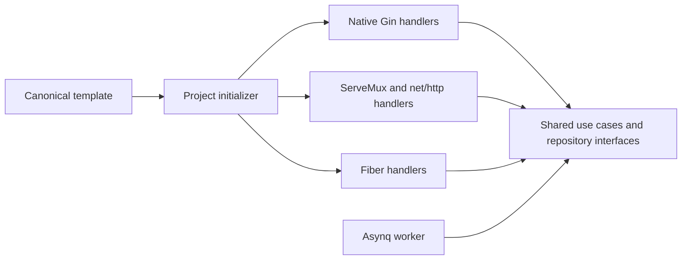

# HTTP Engines

Projects select an HTTP engine during creation. The engine is recorded in `.gobase.json`. The application does not read this file at runtime. Changing its value does not migrate an existing project.

| Engine | Router | Handler API | Version |
|--------|--------|-------------|---------|
| `gin` (default) | Gin | `*gin.Context` | v1.12.0 |
| `stdlib` | `http.ServeMux` | `http.ResponseWriter`, `*http.Request` | Go 1.27.1 |
| `fiber` | Fiber | `*fiber.Ctx` | v2, current template dependency |

```bash
make init ENGINE=gin MODULE=github.com/org/api APP_NAME=api OUTPUT=../api
make init ENGINE=stdlib MODULE=github.com/org/api APP_NAME=api OUTPUT=../api
make init ENGINE=fiber MODULE=github.com/org/api APP_NAME=api OUTPUT=../api
```

Run one command with a new output directory. Existing directories are rejected. The initializer resolves dependencies with `go mod tidy`. It excludes local environment files, private keys, and the template initializer from generated projects.

## Architecture



Use cases, DTOs, entities, repositories, migrations, and workers are shared. Endpoint sources are maintained separately under `pkg/scaffold/templates/gin`, `pkg/scaffold/templates/stdlib`, and `pkg/scaffold/templates/fiber`. Gin endpoints receive `*gin.Context`. Standard HTTP endpoints receive `http.ResponseWriter` and `*http.Request`. Fiber endpoints receive `*fiber.Ctx`.

The initializer copies the selected engine's source files directly. It does not parse or convert another engine's handlers. Gin and stdlib share standard HTTP middleware, request parsing, response envelopes, and server lifecycle code under `pkg/scaffold/templates/nethttp`. Their routing helper preserves case insensitive paths and optional trailing slashes. Gin and stdlib outputs have no Fiber or fasthttp runtime dependency.

The runnable checkout retains its Fiber integration for compatibility. These checkout handlers are not the source for generated Gin, stdlib, or Fiber projects. Each generated project uses its own engine templates. Changes to an endpoint must update the corresponding engine sources. Shared HTTP contract tests check their behavior.

Generated projects receive application documentation from `pkg/scaffold/application`. Their README identifies the selected engine. Template maintenance documents, historical plans, and source-only tools are omitted. New example configurations use local storage; the Docker app and worker share a volume. MinIO is optional. See [deployment](deployment.md) for S3 configuration.

Standard HTTP middleware can wrap a Gin or stdlib router with `func(http.Handler) http.Handler`. The Gin routing adapter passes native handlers through this middleware and preserves their response writers. Fiber projects use Fiber middleware. Fiber prefork is specific to Fiber; the standard HTTP server runs one process.

## Code Generation

`make gen-full` reads `.gobase.json` and renders the selected engine's CRUD templates from `pkg/codegen/generator/templates/handler`. Each engine has independent templates. The generator does not convert Fiber code. `make wire` registers the new feature with the existing router and dependency container. Projects without `.gobase.json` retain Fiber generation for compatibility.

```bash
make gen-full MIGRATION=000012_create_orders.up.sql
make wire
make build
```

## Verification

See [Local Verification Results](http-engines-verification.md) for the completed checks and their environment.

From the template checkout, run `make test-engines`. This generates all three projects, resolves and verifies modules, builds the app and worker, checks runtime dependencies, and runs tests with the race detector. It also generates and wires a new CRUD feature, regenerates and checks Swagger, and compiles the result. Use `go run ./pkg/tools/verifyengines -engine=stdlib -lint` to include lint for one engine.

The shared HTTP contract suite runs against real HTTP servers. It covers JSON parsing, validation, JWT auth, article CRUD and ownership errors, profile updates, multipart uploads, pagination, CORS, health probes, rate limiting, body limits, Swagger, and metrics. The Engines workflow runs these checks for every engine. Integration tests require PostgreSQL, Redis, and a running application.

## Next Phases

The [roadmap](roadmap.md) tracks engine foundation, minimal service output, monorepo generation, and a two-service HTTP communication example. A future generated workspace selects one engine per service and keeps each service's module and business implementation independent. Minimal output and workspace generation are planned capabilities. The current initializer still creates one full application.

Email verification, password reset, and OpenTelemetry metrics export remain deferred application features. The [release readiness report](release-readiness.md) records completed local Docker and worker checks, the tested implementation revision, and passing GitHub Actions results for all three engines.
