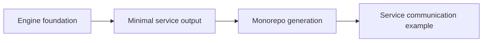

# Gobase Roadmap

Updated: October 7, 2026.

This document plans work on the gobase template and generator. The agreed direction is engine foundation, minimal service output, monorepo generation, and a tested service communication example. Phase 1 is merged. Phase 2.1 is implemented and verified in an open PR. The remaining stages are planned and have not been implemented.

## Current Baseline

The HTTP engine refactor is implemented and verified locally and in GitHub Actions. Project creation supports Gin, standard `net/http`, and Fiber. Each engine has independent endpoint and CRUD generator templates. Use cases, DTOs, entities, repositories, migrations, and workers remain shared.

The engine is selected during project creation. `.gobase.json` records that choice for code generation. Changing this file does not migrate an existing application. The runnable template checkout retains Fiber for compatibility.

All three generated projects passed local builds, race tests, lint, shared HTTP contracts, and integration tests with PostgreSQL and Redis. [PR #46](https://github.com/zoe606/gobase/pull/46) merged on October 5, 2026 as `66270fb626b7b6b5df208ce94b0d17f52fca8890`. GitHub Actions Quality and all three engine jobs passed on that `master` revision, including Linux amd64 Docker app and worker runtime checks. See the [release readiness report](release-readiness.md) for workflow links and the [local verification results](http-engines-verification.md) for environment details.

## Phase Order

| Phase | Outcome | Status |
|-------|---------|--------|
| HTTP engine refactor | Three engines with native handlers and shared core | Implemented; local and GitHub verification passed |
| 1. Template release readiness | Reproducible setup and CI evidence for all engines | Complete and merged; master CI passed |
| 2. Engine foundation | Consistent HTTP behavior, resource shutdown, and Docker runtime | 2.1 verified in PR #53; Redis and Docker work planned |
| 3. Minimal service output | A service without bundled application features or required infrastructure | Planned; [#54](https://github.com/zoe606/gobase/issues/54) |
| 4. Monorepo generation | Independent service modules with root development commands | Planned; [#55](https://github.com/zoe606/gobase/issues/55) |
| 5. Service communication example | Two independently running services with tested HTTP communication | Planned; [#56](https://github.com/zoe606/gobase/issues/56) |
| Optional application features | Email verification, password reset, and OpenTelemetry metrics export | Deferred until needed by a generated application |



Gobase remains the source template and generator. A monorepo is a generated workspace. Each service selects one HTTP engine when it is created. A workspace does not need to use all three engines.

## Phase 1: Template Release Readiness

Release readiness and maintenance checks are complete and merged. Release publication remains a separate step.

See the [release readiness report](release-readiness.md) for implemented changes, completed local and GitHub checks, and compatibility notes.

### Work

- Run the Engines workflow for Gin, stdlib, and Fiber. Inspect build, test, code generation, lint, vulnerability scan, and integration results. Record the workflow run and commit used.
- Keep local Compose and integration workflows on PostgreSQL 17. Update the documented support and verification together when changing this version.
- Follow the README from a new output directory for each engine. Check configuration, migrations, HTTP startup, worker startup, health probes, and shutdown. Record the commands that actually work.
- Build and run the Docker app and worker images for each output. The existing Linux binary builds do not verify the runtime images.
- Regenerate Swagger after generating and wiring a feature in each engine. Check that documented routes, request schemas, and response codes match the running application.
- Update the contribution guide with the source locations for endpoint templates, CRUD templates, shared HTTP helpers, and shared contract tests. Endpoint changes must update all affected engine templates. Changes to the runnable checkout may also require its Fiber handler to be updated.
- Separate template maintenance instructions from generated application instructions. Generated documentation should identify the selected engine and avoid commands for tools omitted from the output.
- Record the verified revision and compatibility notes in release documentation.

### Completion Criteria

- All three engine jobs pass on the revision being released.
- A fresh generated project follows the documented setup successfully for every engine.
- Docker app and worker images start, perform their expected work, and stop cleanly for every engine.
- Generated CRUD routes and Swagger documentation agree with the tested HTTP contracts.
- The supported PostgreSQL version or versions are explicit and tested.
- Contributors can identify the files and verification required for a shared endpoint change.

### Verification

Reuse `make check-all`, `go run ./pkg/tools/verifyengines -lint`, and the existing integration suite. Add focused coverage only for behavior or generation paths that these checks do not cover. Record Docker runtime and Swagger checks separately from the existing binary build results.

## Phase 2: Engine Foundation

Finish the existing engine and runtime foundation before adding workspace generation. Request parsing, validation, response formats, middleware, health checks, graceful shutdown, builds, and code generation must remain covered for Gin, stdlib, and Fiber. The existing HTTP contracts and engine workflow provide this baseline.

### Execution Order

Implement one slice at a time on a new branch from `master`. Each slice needs its own scope, verification, and PR before the next slice starts. [PR #53](https://github.com/zoe606/gobase/pull/53) implements Phase 2.1 and has passed Quality and all three engine checks. Merge the documentation update and PR #53 before starting Redis ownership work.

Update the template README and `pkg/scaffold/application/README.md.tmpl` when a slice changes feature availability or setup instructions.

| Order | Issue | Completion evidence |
|-------|----------------|---------------------|
| 2.1 | [#48: Validate article list filters](https://github.com/zoe606/gobase/issues/48) | Agreed invalid-filter response, preserved valid requests, and passing shared HTTP contracts |
| 2.2 | [#51: Define Redis client ownership and shutdown](https://github.com/zoe606/gobase/issues/51) | Cache and rate limiter lifecycle checks, including disabled and memory configurations |
| 2.3 | [#52: Run Docker as a non-root user](https://github.com/zoe606/gobase/issues/52) | Startup, upload, worker processing, and shutdown under the configured UID and GID |

The first slice is 2.1. Its response contract was agreed on October 6, 2026: accept omitted or empty status and the exact values `draft` and `published`; reject other values with HTTP 400, `VALIDATION_ERROR`, and the existing field validation response. Malformed queries retain `INVALID_QUERY`. Pagination normalization retains its current behavior.

### 2.1 Article List Validation

On merged `master`, `ListRequest.Status` declares allowed values, but the article list handlers do not call the validator. PR #53 adds validation in the checkout and all three engine templates. The use case still normalizes pagination. The implementation remains pending merge.

- Implement the agreed response contract above. Rejecting a previously accepted invalid status is an intentional API behavior change.
- Apply the agreed validation consistently in the runnable checkout and all engine templates.
- Extend the shared HTTP contract suite for the changed cases. Existing valid requests must retain their behavior.

### 2.2 Redis Ownership and Shutdown

`initAppCache` and `initRateLimitStorage` currently create separate Redis clients.

- Make connection ownership and shutdown explicit for these clients. Share a client only where configuration and lifecycle are compatible.
- Preserve memory rate limiting and disabled-cache configurations.
- Check readiness, shutdown, and Redis failure behavior with both cache and Redis rate limiting enabled.

### 2.3 Docker Non-Root Runtime

The final Docker image uses `scratch` without a `USER` instruction.

- Run app and worker images with an explicit non-root UID and GID.
- Set permissions for local uploads and any required temporary files. Keep configuration, migrations, and certificates readable.
- Verify startup, an upload, a worker task, and graceful shutdown in the runtime images.

### Completion Criteria

- Each completed slice has focused verification and updated documentation.
- Shared HTTP changes pass the contracts and integration tests for all three engines.
- Owned Redis clients close during shutdown, including clients used by cache and rate limiting.
- Docker app and worker images operate as the configured non-root user.
- Existing valid API requests, engine selection, code generation, and worker behavior remain covered by regression checks.

## Phase 3: Minimal Service Output

Tracking: [#54](https://github.com/zoe606/gobase/issues/54). Start after Phase 2 is complete and merged.

The initializer currently copies a complete application with auth, articles, media, translation, migrations, and workers. Copying this output into every service would add features and infrastructure that the service may not need.

- Define the minimal file and dependency set before changing generation. Keep configuration, logging, the selected native HTTP engine, request and response helpers, health checks, and graceful shutdown.
- Make minimal output an explicit choice. Keep the current full application output as the default and preserve existing project creation commands.
- Omit bundled business features and their routes, migrations, configuration, and dependencies from minimal output.
- Allow a minimal service to start without PostgreSQL, Redis, object storage, an email sender, or an Asynq worker. Its readiness check must reflect the dependencies it actually uses.
- Define which CRUD generation commands are supported in minimal output. Commands that require omitted persistence must report that requirement clearly.
- Provide setup documentation for the files and commands actually generated.

### Completion Criteria

- Fresh minimal outputs build, start, answer health checks and a small HTTP contract, and stop cleanly for all three engines without external infrastructure.
- The dependency graph and generated configuration omit the excluded application features.
- The existing full output still passes its current generation and engine checks.
- Output selection, supported code generation, and compatibility are documented and tested.

## Phase 4: Monorepo Generation

Tracking: [#55](https://github.com/zoe606/gobase/issues/55). Start after Phase 3 is complete and merged.

A monorepo contains multiple services in one repository. Separate service processes and deployments are additional properties; putting applications in subdirectories does not establish service boundaries.

```text
workspace/
  go.work
  Makefile
  services/
    service-a/
      go.mod
      .gobase.json
    service-b/
      go.mod
      .gobase.json
  contracts/
  deployment/
```

- Generate services from the minimal output. Each service selects one engine and owns its Go module, application configuration, and build artifact.
- Use `go.work` for local development. Each service must also build and test with `GOWORK=off`.
- Provide root commands to build and test all services, run a selected service, and start the local Compose environment. Document service names, ports, and configuration.
- Define workspace creation and service addition commands. Reject duplicate names and existing output paths without overwriting service files. Preserve standalone project generation.
- Keep business use cases, repositories, entities, and migrations inside their owning service. Services must not import another service's internal implementation or access its tables directly.
- Store communication schemas and fixtures under `contracts`. Add shared Go packages only when an actual shared requirement exists.
- Keep this phase limited to workspace generation and independent execution. The next phase demonstrates communication.

### Completion Criteria

- A generated two-service workspace supports independent engine choices, root commands, and local Compose startup.
- Each service builds and tests independently with `GOWORK=off` and produces its own Docker image.
- Adding a service preserves existing files and each service's engine setting.
- All three engine choices remain covered, and standalone generation keeps its current behavior.

## Phase 5: Service Communication Example

Tracking: [#56](https://github.com/zoe606/gobase/issues/56). Start after Phase 4 is complete and merged.

Use one small two-service example to verify the generated workspace. The example demonstrates a business boundary and HTTP communication. It does not become a required application feature.

- Define the request, response, and failure contract before adding handlers or clients.
- Run the services as separate processes. The caller uses HTTP with a bounded timeout and request context cancellation. Define which request ID headers are propagated.
- Keep data ownership inside each service. The caller must not import the receiver's repository or read its database.
- Cover successful responses, invalid requests, unavailable downstream service, timeout, and graceful shutdown with integration tests.
- Reuse the same example for representative engine pairs: Gin to stdlib, stdlib to Fiber, and Fiber to Gin. This verifies every engine as caller and receiver without requiring three services in the generated example.
- Document local startup, the example request, service-specific builds, and how to reproduce a downstream failure.

### Completion Criteria

- The two services build and run independently and communicate using the documented contract.
- Integration tests pass for the three representative engine pairs.
- Downstream failures and timeouts return the documented response without leaving requests blocked.
- A fresh workspace follows the documented local run procedure successfully.

## Optional Application Features

These issues remain open as deferred work. They are not prerequisites for engine foundation, minimal service output, monorepo generation, or the communication example. Resume them when a generated application needs the capability.

### Email Verification and Password Reset

Tracking: [#49](https://github.com/zoe606/gobase/issues/49).

The auth use cases and tests exist. HTTP auth routes cover register, login, refresh, logout, and the current user. Verification and reset use cases still contain email enqueue placeholders.

- Register the missing HTTP flows using each engine's native handler API.
- Connect verification, resend, and password reset requests to the existing Asynq email worker.
- Test request, queued email, worker processing, and token consumption together. Include expired tokens, repeated consumption, delivery failure, and the existing password reset response for an unknown email.
- Update DTOs, Swagger, configuration instructions, and shared HTTP contracts.

### OpenTelemetry Metrics

Tracking: [#50](https://github.com/zoe606/gobase/issues/50).

`pkg/telemetry/telemetry.go` configures a trace provider. `pkg/telemetry/metrics.go` declares metric instruments, but telemetry initialization does not configure a MeterProvider or a metrics exporter.

- Select and document the metrics export configuration before implementation.
- Initialize and shut down the metrics provider with the existing telemetry lifecycle.
- Verify that database, cache, and worker instruments produce exported measurements when enabled. Keep disabled telemetry working.
- Preserve the existing HTTP `/metrics` behavior. Document how it relates to OpenTelemetry export.

## GitHub Issue Tracking

Issue #48 has a verified implementation in open PR #53. Issues #51 and #52 track the remaining foundation work, in that order. Issues #49 and #50 remain open and deferred. Issues #54, #55, and #56 track Phases 3, 4, and 5. All three later phases remain planned.

Use one issue for each bounded outcome. This document defines the phase order and scope. GitHub issues track execution status and links to implementing PRs. Update the template README and generated application documentation when implemented behavior changes.

Link each implementation PR to its issue. Use `Closes #<issue-number>` only when the PR completes all acceptance criteria. Close the issue after the PR is merged and the relevant checks pass. If a PR completes only part of an issue, keep it open and list the remaining work. Record deferred work explicitly instead of marking it complete.

## Scope Limits

Keep existing full applications compatible while adding the new outputs. Minimal output and monorepo generation are planned capabilities, not available commands.

Additional engines, runtime engine switching, conversion of existing applications, a universal HTTP handler API, and a rewrite of the shared business layers are outside these phases. Kubernetes, a service mesh, an API gateway, and a new message broker are outside the initial workspace and communication example.

## References

- [HTTP engine architecture](http-engines.md)
- [Local engine verification](http-engines-verification.md)
- [Code patterns](code-patterns.md)
- [Deployment](deployment.md)
