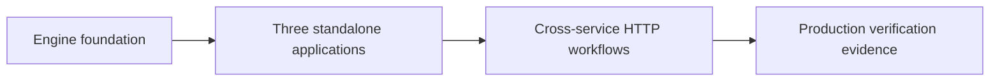
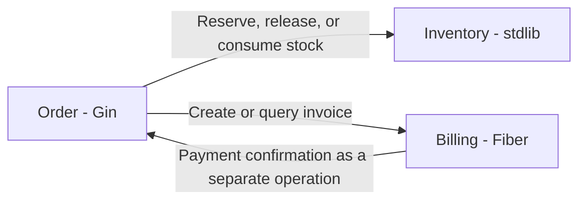

# Gobase Roadmap

Updated: October 9, 2026.

This document plans work on the gobase template and its use in real applications. The user clarified on October 8, 2026 that the next goal is three standalone applications with different business domains, one per engine, followed by HTTP workflows between them. Each application has its own repository. Monorepo generation is outside the current plan. Phases 1 and 2 are merged. Phase 3 minimal output is implemented in PR #59. Issues #60 and #56 track the planned application and HTTP validation work.

## Current Baseline

The HTTP engine refactor is implemented and verified locally and in GitHub Actions. Project creation supports Gin, standard `net/http`, and Fiber. Each engine has independent endpoint and CRUD generator templates. Use cases, DTOs, entities, repositories, migrations, and workers remain shared.

The engine is selected during project creation. `.gobase.json` records that choice for code generation. Changing this file does not migrate an existing application. The runnable template checkout retains Fiber for compatibility.

Project creation also selects `PROFILE=full|minimal`. Full remains the default. Minimal output uses the selected native engine and starts without PostgreSQL, Redis, storage, email, or a worker. See [minimal services](minimal-services.md) for its file set, dependency policy, commands, and compatibility.

All three generated projects passed local builds, race tests, lint, shared HTTP contracts, and integration tests with PostgreSQL and Redis. [PR #46](https://github.com/zoe606/gobase/pull/46) merged on October 5, 2026 as `66270fb626b7b6b5df208ce94b0d17f52fca8890`. GitHub Actions Quality and all three engine jobs passed on that `master` revision, including Linux amd64 Docker app and worker runtime checks. See the [release readiness report](release-readiness.md) for workflow links and the [local verification results](http-engines-verification.md) for environment details.

[PR #53](https://github.com/zoe606/gobase/pull/53) merged article list validation on October 8, 2026 as `e8f433bdde4e64a52fc583e996d415f73d477191`. Quality and all three engine jobs passed on that merged revision.

## Phase Order

| Phase | Outcome | Status |
|-------|---------|--------|
| HTTP engine refactor | Three engines with native handlers and shared core | Implemented; local and GitHub verification passed |
| 1. Template release readiness | Reproducible setup and CI evidence for all engines | Complete and merged; master CI passed |
| 2. Engine foundation | Consistent HTTP behavior, resource shutdown, and Docker runtime | Complete; PRs #53, #57, and #58 merged |
| 3. Minimal service output | Optional service profile without bundled application features or required infrastructure | Implemented; checks passed on PR #59 implementation revision; merge tracked by [#54](https://github.com/zoe606/gobase/issues/54) |
| 4. Standalone application validation | Three real applications with different domains, one per engine | Planned; [#60](https://github.com/zoe606/gobase/issues/60) |
| 5. HTTP workflow validation | Tested business workflows across the independent applications | Planned; [#56](https://github.com/zoe606/gobase/issues/56) |
| Optional application features | Email verification, password reset, and OpenTelemetry metrics export | Deferred until needed by a generated application |

Gobase remains the source template and generator. The applications are separate projects with different responsibilities. Each selects one engine during creation and owns its code, data, and deployment. Use the full profile when its bundled features are needed. Minimal output remains optional; it is not a prerequisite for application validation.

The earlier monorepo plan came from an incorrect interpretation of the user's goal. Issue #55 records that superseded work. The revised plan tests real applications and their dependencies. Template and Docker checks already passed, but the business workflows, production deployment, workload, and recovery evidence below remain unverified.

## Phase 1: Template Release Readiness

Release readiness and maintenance checks are complete and merged. Release publication remains a separate step.

See the [release readiness report](release-readiness.md) for implemented changes, completed local and GitHub checks, and compatibility notes.

### Work

- Run the Engines workflow for Gin, stdlib, and Fiber. Inspect build, test, code generation, lint, vulnerability scan, and integration results. Record the workflow run and commit used.
- Keep local Compose and integration workflows on PostgreSQL 17. Update the documented support and verification together when changing this version.
- Follow the README from a new output directory for each engine. Check configuration, migrations, HTTP startup, worker startup, health probes, and shutdown. Record the commands that actually work.
- Build and run the Docker app and worker images for each output. The existing Linux binary builds do not verify the runtime images.
- Regenerate Swagger after generating and wiring a feature in each engine. Check that documented routes, request schemas, and response codes match the running application.
- Update the contribution guide with the source locations for endpoint templates, CRUD templates, shared HTTP helpers, and shared contract tests. Endpoint changes must update all affected engine templates. Changes to the runnable checkout may also require its Fiber handler to be updated.
- Separate template maintenance instructions from generated application instructions. Generated documentation should identify the selected engine and avoid commands for tools omitted from the output.
- Record the verified revision and compatibility notes in release documentation.

### Completion Criteria

- All three engine jobs pass on the revision being released.
- A fresh generated project follows the documented setup successfully for every engine.
- Docker app and worker images start, perform their expected work, and stop cleanly for every engine.
- Generated CRUD routes and Swagger documentation agree with the tested HTTP contracts.
- The supported PostgreSQL version or versions are explicit and tested.
- Contributors can identify the files and verification required for a shared endpoint change.

### Verification

Reuse `make check-all`, `go run ./pkg/tools/verifyengines -lint`, and the existing integration suite. Add focused coverage only for behavior or generation paths that these checks do not cover. Record Docker runtime and Swagger checks separately from the existing binary build results.

## Phase 2: Engine Foundation

Finish the existing engine and runtime foundation before building the standalone applications. Request parsing, validation, response formats, middleware, health checks, graceful shutdown, builds, and code generation must remain covered for Gin, stdlib, and Fiber. The existing HTTP contracts and engine workflow provide this baseline.

### Execution Order

Implement one slice at a time on a new branch from `master`. Each slice needs its own scope, verification, and merged PR before the next slice starts. The documentation update in PR #47, article list validation in PR #53, Redis ownership in PR #57, and Docker non-root runtime in PR #58 are merged. Phase 3 started from the merged Phase 2 baseline.

Update the template README and `pkg/scaffold/application/README.md.tmpl` when a slice changes feature availability or setup instructions.

| Order | Issue | Completion evidence |
|-------|----------------|---------------------|
| 2.1 | [#48: Validate article list filters](https://github.com/zoe606/gobase/issues/48) | Agreed invalid-filter response, preserved valid requests, and passing shared HTTP contracts |
| 2.2 | [#51: Define Redis client ownership and shutdown](https://github.com/zoe606/gobase/issues/51) | Cache and rate limiter lifecycle checks, including disabled and memory configurations |
| 2.3 | [#52: Run Docker as a non-root user](https://github.com/zoe606/gobase/issues/52) | Startup, upload, worker processing, and shutdown under the configured UID and GID |

The first slice is 2.1. Its response contract was agreed on October 6, 2026: accept omitted or empty status and the exact values `draft` and `published`; reject other values with HTTP 400, `VALIDATION_ERROR`, and the existing field validation response. Malformed queries retain `INVALID_QUERY`. Pagination normalization retains its current behavior.

### 2.1 Article List Validation

PR #53 merged validation in the checkout and all three engine templates. The use case still normalizes pagination.

- The agreed response contract above is implemented. Rejecting a previously accepted invalid status is an intentional API behavior change.
- Validation is consistent in the runnable checkout and all engine templates.
- The shared HTTP contract suite covers the changed cases and existing valid requests.

### 2.2 Redis Ownership and Shutdown

`initRedisStores` creates the cache and rate limiter stores with separate Redis clients and returns one cleanup function to the application bootstrap. `Run` defers this cleanup until after HTTP shutdown. Disabled cache and memory rate limiting create no Redis clients for those stores.

PR #57 merged this slice. Issue #51 is closed.

- Keep separate clients so each store retains its existing ownership and closing one does not close the other.
- Close both clients, including when Redis is unavailable or one client is already closed. Repeated cleanup is safe.
- Preserve memory rate limiting and disabled-cache configurations. Readiness still checks PostgreSQL.
- Cover lifecycle and Redis failure behavior with tests copied into every generated engine. The shared HTTP contracts cover cache and Redis rate limiting enabled together.

### 2.3 Docker Non-Root Runtime

The final app and worker images use `scratch` with `USER 65532:65532`. The image provides writable `/uploads` and `/tmp` directories. Configuration and migrations copied into the image belong to the runtime user, and the system CA certificate bundle is readable.

- Fresh Compose upload volumes inherit the image's directory ownership. Both containers use the same UID and GID. Existing root-owned volumes require an ownership update before startup.
- Host configuration bind mounts retain host permissions. The template and generated application README link to [runtime permissions](deployment.md#runtime-permissions) for local configuration, secret files, custom mounts, and volume upgrades.
- The Engines workflow verifies actual process identity, filesystem access, upload, three image variants written by the worker, welcome email processing, and exit code `0` after shutdown for all three engines.

[PR #58](https://github.com/zoe606/gobase/pull/58) merged on October 8, 2026 as `619162fddc412a32c2b4344171d083f0dac4dbf8`. Issue #52 is closed.

### Completion Criteria

- Each completed slice has focused verification and updated documentation.
- Shared HTTP changes pass the contracts and integration tests for all three engines.
- Owned Redis clients close during shutdown, including clients used by cache and rate limiting.
- Docker app and worker images operate as the configured non-root user.
- Existing valid API requests, engine selection, code generation, and worker behavior remain covered by regression checks.

## Phase 3: Minimal Service Output

Tracking: [#54](https://github.com/zoe606/gobase/issues/54). Implemented in this source. The issue remains open through PR verification and merge.

The default initializer output remains a complete application with auth, articles, media, translation, migrations, and workers. `PROFILE=minimal` selects a separate file set for services that do not need those features. [Minimal service documentation](minimal-services.md) defines the file and dependency set used by the implementation.

The minimal profile includes optional configuration, logging, native routing, shared response envelopes, request IDs, recovery, health checks, and shutdown. Its generated CI and app-only Docker Compose require no infrastructure. SQL generation and wiring commands report that they require the full profile. A missing profile in existing project metadata still means full.

- Define the minimal file and dependency set before changing generation. Keep configuration, logging, the selected native HTTP engine, request and response helpers, health checks, and graceful shutdown.
- Make minimal output an explicit choice. Keep the current full application output as the default and preserve existing project creation commands.
- Omit bundled business features and their routes, migrations, configuration, and dependencies from minimal output.
- Allow a minimal service to start without PostgreSQL, Redis, object storage, an email sender, or an Asynq worker. Its readiness check must reflect the dependencies it actually uses.
- Define which CRUD generation commands are supported in minimal output. Commands that require omitted persistence must report that requirement clearly.
- Provide setup documentation for the files and commands actually generated.

### Completion Criteria

- Fresh minimal outputs build, start, answer health checks and a small HTTP contract, and stop cleanly for all three engines without external infrastructure.
- The dependency graph and generated configuration omit the excluded application features.
- The existing full output still passes its current generation and engine checks.
- Output selection, supported code generation, and compatibility are documented and tested.

## Phase 4: Standalone Application Validation

Tracking: [#60](https://github.com/zoe606/gobase/issues/60). Use a recorded merged gobase revision. Use the minimal profile from PR #59 only after it merges if the selected application needs that profile.

The selected scenario is commerce with Order using Gin, Inventory using stdlib, and Billing using Fiber. The user selected these domains on October 8, 2026. Repository names and locations, deployment environment, workload targets, and detailed business contracts must be defined before application implementation.

| Application | Engine | Owned data and behavior |
|-------------|--------|-------------------------|
| Order | Gin | Order records, workflow state, and coordination of stock and invoice operations |
| Inventory | stdlib | Products, stock balances, reservations, release, and stock consumption |
| Billing | Fiber | Invoices, recorded payment state, and payment confirmation |

The initial workflow creates an order, reserves stock, creates an invoice, records payment, and completes the order. Each service commits its own state. Define failure and recovery behavior for each step before implementation. Real payment processing is a separate integration decision; invoice and payment-state tests do not prove external payment processing.

- Create three separate repositories. Each owns its Go module, engine metadata, configuration, migrations, data, tests, image, and CI. Record the source template revision.
- Implement complete business workflows beyond generated CRUD and health routes. Add only features used by the selected product.
- Test HTTP requests and persisted results against running applications and their actual dependencies. Cover validation, authentication, and access rules for the selected resources. Cover file and worker behavior when used.
- Verify production configuration and deploy each app to the selected controlled environment. Record dependency versions, resources, configuration, and substituted providers.
- Verify dependency failures, bounded operations, process shutdown, restarts, and retained data. Where persistence is used, verify production migration procedures and backup and restore.
- Agree on workload and pass criteria before measuring latency, throughput, errors, and resource usage. Compare each result against its application's requirements.
- Fix generated foundation defects in gobase. Apply the fix to every affected application and verify it there. Keep product rules in their owning application.
- Record each check as passed, failed, or not tested. State the limits of the production-readiness conclusion.

### Completion Criteria

- Each standalone project has a real workflow, independent CI, reproducible setup, and a tested deployment.
- Business, production configuration, failure, restart, migration, and recovery checks pass for each application's actual dependencies.
- Workload results meet the agreed criteria and include environment details.
- The evidence report identifies application revisions, the source template revision, upstream fixes, and remaining limitations.

## Phase 5: HTTP Workflow Validation

Tracking: [#56](https://github.com/zoe606/gobase/issues/56). Extend the applications from Phase 4 with their actual business dependencies. Define contracts before implementing calls.

The three services use HTTP without a new cross-service message broker. Define calls from the business workflow. Every service participates, but the design does not require every service to call every other service. Avoid recursive synchronous call chains. If a service calls back to another service, define it as a separate operation with its own state and retry rules.

This is a proposed business call graph. Finalize the endpoint and state contracts before implementing it. A callback must not run while holding a database transaction that blocks the receiver's request. The services communicate through APIs and do not query each other's databases. Additional calls require a business purpose.

- Document the business flow, data ownership, call graph, request and response schemas, status codes, caller authentication, and API version compatibility.
- Use bounded HTTP clients with request context cancellation. Propagate request IDs and identify downstream calls in logs.
- Define idempotency for operations that may be repeated. Retry only when the operation is safe, with a bounded attempt and time budget.
- Define persisted operation states and partial-failure recovery. Document how to recover when one service succeeds and a later service fails or its response is lost.
- Test success, invalid requests, rejected callers, missing resources, unavailable and slow downstream services, duplicate requests, partial failure, restart, and graceful shutdown.
- Start pinned images from the independent repositories for integration verification. Keep modules, databases, and deployments independently owned. A common test environment does not change repository ownership.
- Record end-to-end workload and failure results against the agreed criteria. Feed foundation defects back into gobase and recheck affected services.

### Completion Criteria

- All three real applications participate in the documented business workflow over HTTP.
- Cross-service contracts and failure scenarios pass against separately running processes with their actual dependencies.
- Requests finish within the agreed timeout budget. Repeated operations and recovery preserve the agreed business result.
- Each application builds, tests, and deploys independently. The integration environment is reproducible from recorded revisions.
- The verification report distinguishes tested behavior, substituted providers, and unverified production claims.

### Optional Message Broker Exercise

Start with the HTTP workflow. A broker exercise is separate follow-up work if the user chooses an asynchronous requirement. Select the broker and one concrete event flow then. Test duplicate delivery, retries, consumer downtime, delivery confirmation, and recovery. Existing in-process or per-service background jobs do not establish a cross-service event protocol.

## Optional Application Features

These issues remain open as deferred work. They are not unconditional prerequisites for application validation. Resume them when one of the selected applications requires the capability.

### Email Verification and Password Reset

Tracking: [#49](https://github.com/zoe606/gobase/issues/49).

The auth use cases and tests exist. HTTP auth routes cover register, login, refresh, logout, and the current user. Verification and reset use cases still contain email enqueue placeholders.

- Register the missing HTTP flows using each engine's native handler API.
- Connect verification, resend, and password reset requests to the existing Asynq email worker.
- Test request, queued email, worker processing, and token consumption together. Include expired tokens, repeated consumption, delivery failure, and the existing password reset response for an unknown email.
- Update DTOs, Swagger, configuration instructions, and shared HTTP contracts.

### OpenTelemetry Metrics

Tracking: [#50](https://github.com/zoe606/gobase/issues/50).

`pkg/telemetry/telemetry.go` configures a trace provider. `pkg/telemetry/metrics.go` declares metric instruments, but telemetry initialization does not configure a MeterProvider or a metrics exporter.

- Select and document the metrics export configuration before implementation.
- Initialize and shut down the metrics provider with the existing telemetry lifecycle.
- Verify that database, cache, and worker instruments produce exported measurements when enabled. Keep disabled telemetry working.
- Preserve the existing HTTP `/metrics` behavior. Document how it relates to OpenTelemetry export.

## GitHub Issue Tracking

Issues #48, #51, and #52 closed when PRs #53, #57, and #58 merged. Issues #49 and #50 remain open and deferred. Issue #54 tracks implemented minimal output through verification and merge. Issue #55 records the superseded monorepo plan and is not planned. Issue #60 tracks standalone application validation. Issue #56 tracks HTTP workflows between those real applications.

Use one issue for each bounded outcome. This document defines the phase order and scope. GitHub issues track execution status and links to implementing PRs. Update the template README and generated application documentation when implemented behavior changes.

Link each implementation PR to its issue. Use `Closes #<issue-number>` only when the PR completes all acceptance criteria. Close the issue after the PR is merged and the relevant checks pass. If a PR completes only part of an issue, keep it open and list the remaining work. Record deferred work explicitly instead of marking it complete.

## Scope Limits

Keep existing full applications compatible. This source provides standalone full and minimal generation. Monorepo generation and a shared Go workspace are outside the current plan. The three applications use different business domains and separate repositories.

Additional engines, runtime engine switching, conversion of existing applications, a universal HTTP handler API, and a rewrite of the shared business layers are outside these phases. Kubernetes, a service mesh, and an API gateway are outside the initial verification work. A message broker is optional later work and is not required for the first HTTP workflow.

## References

- [HTTP engine architecture](http-engines.md)
- [Local engine verification](http-engines-verification.md)
- [Code patterns](code-patterns.md)
- [Deployment](deployment.md)
